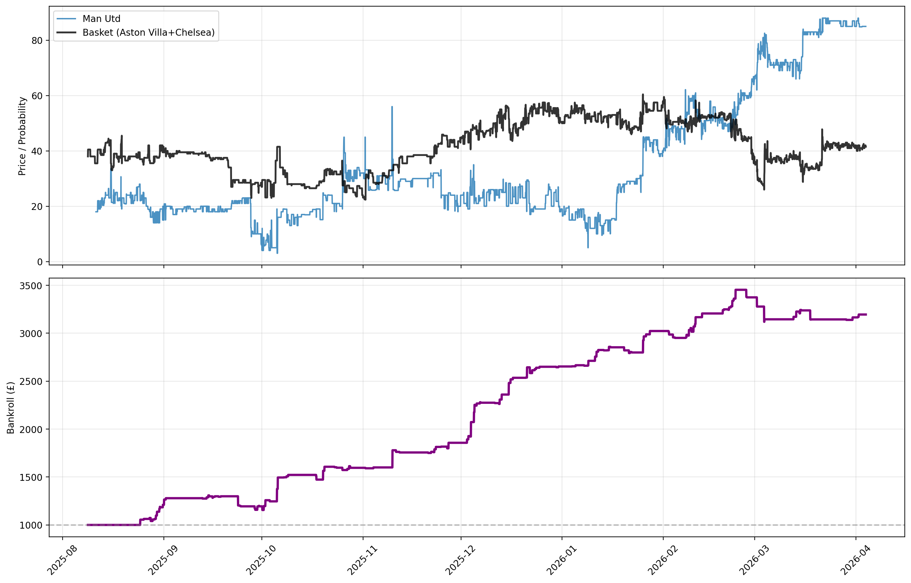

# Exploring Synthetic Basket Relationships in Prediction Markets

### A small experiment in relative value and synthetic baskets using prediction market data.

---

## Overview

The Premier League Top 4 race provides a natural example of interdependent probabilities. With a limited number of qualifying spots available, the chances of one team finishing in the Top 4 are directly linked to the others.

This project explores whether temporary inconsistencies arise in these relationships. A simple synthetic basket is constructed from peer teams, and deviations from this basket are analysed over time.

The goal is not to build a production trading system, but to investigate whether these deviations contain systematic structure or instead reflect differences in the speed and manner in which information is incorporated across related contracts.

---

## Motivation

In traditional markets, synthetic baskets are commonly used in relative value strategies to compare assets against a constructed benchmark.

In prediction markets, contracts representing related outcomes are inherently linked. Teams competing for the same positions create a constrained probability structure, where changes in one contract should influence others.

This raises the question: do short-term inconsistencies emerge in these relationships, and are they large enough to persist after accounting for execution costs?

---

## Methodology

### Basket Construction

For each target team, a synthetic basket is constructed as the average probability of the remaining two teams. The spread is defined as:

Target − Basket

### Signal Generation

The spread is standardised using a rolling mean and standard deviation to produce a z-score.

* Entry: when the spread deviates beyond a threshold
* Exit: when it reverts toward the mean
* Positions flip automatically if the signal reverses

All signals are shifted forward to avoid lookahead bias.

### Execution Assumptions

To avoid unrealistic results, simplified trading friction is included:

* One-period execution delay (signals execute on the next interval)
* Volatility-adjusted slippage
* Flat commission per trade (entry and exit)
* Fixed position sizing (no compounding)

### Data Handling

* Data is resampled to hourly intervals
* Missing values are forward-filled
* Extreme probability zones (near 0% or 100%) are excluded

---

## Results

After incorporating transaction costs, the strategy remains profitable in several configurations, although performance varies across teams.

### Example Results

| Target      | Basket                | Net Profit (£) | Return (%) | Win Rate (%) | Profit Factor | Max Drawdown (%) |
| ----------- | --------------------- | -------------- | ---------- | ------------ | ------------- | ---------------- |
| Aston Villa | Man Utd + Chelsea     | 894.85         | 89.5       | 55.4         | 1.70          | -13.8            |
| Man Utd     | Aston Villa + Chelsea | 2195.83        | 219.6      | 64.5         | 2.87          | -11.6            |
| Chelsea     | Aston Villa + Man Utd | 1290.70        | 129.1      | 57.7         | 1.89          | -15.7            |

### Example Equity Curve

Performance is not uniform across teams, suggesting that the observed behaviour may be influenced by asymmetric factors such as liquidity, update frequency, or market attention.

---

## Limitations

* **Assumption of similar teams**
  The approach assumes teams are broadly comparable in quality. In reality, form changes, injuries, or managerial shifts can break this relationship.

* **End-of-season effects**
  As outcomes become more certain, probability dynamics become increasingly dominated by boundary effects and information convergence, altering the structure of cross-sectional relationships between contracts.

* **Liquidity variation**
  Different contracts may have varying depth and execution quality, which is not fully captured in the model.

* **Data limitations**
  Missing observations and forward filling may introduce artificial divergence between contracts.

* **Backtest limitations**
  Results are based on historical data and simplified assumptions, and may not generalise to future market conditions.

---

## Next Steps

* Test lead-lag relationships between teams
* Explore alternative basket constructions (e.g. weighted or regression-based)
* Incorporate more realistic execution constraints
* Evaluate robustness across different seasons or datasets

---

## Repository Structure

* `notebook.ipynb` — main analysis and backtest
* `results/` — generated plots
* `AllTop4Data.csv` — input data

---

## Summary

This project demonstrates how synthetic baskets can be used to explore relative relationships in prediction markets. It highlights both the potential for identifying inconsistencies and the difficulty of distinguishing true inefficiencies from data and market structure effects.
