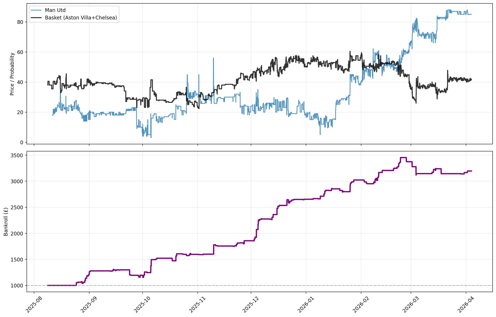

# Exploring Synthetic Basket Relationships in Prediction Markets

### A small experiment in relative-value trading and synthetic baskets using prediction-market data.

---

## Overview

The Premier League Top 4 race provides a natural example of related prediction-market contracts. Because teams are competing for a limited number of qualifying positions, changes in one team's probability may affect the probabilities of its competitors.

This project tests a simple relative-value strategy:

> When one team's Top 4 probability becomes unusually high or low relative to a basket of peer teams, take a position that benefits if the relative difference begins to reverse.

For each target team, the average probability of the other two teams is used as a synthetic benchmark. The difference between the target and this benchmark is monitored over time.

The project investigates whether unusually large deviations contain systematic structure, or whether they instead reflect differences in liquidity, market attention, stale pricing, or the speed at which information is incorporated across related contracts.

The goal is not to present a production-ready trading system, but to explore the behaviour and limitations of relative-value signals in prediction markets.

---

## Strategy at a Glance

The strategy trades short-term mean reversion in the spread between one target team and an equal-weight basket of two peer teams.

For each target team:

1. Calculate the average probability of the other two teams.
2. Use this average as a synthetic basket.
3. Subtract the basket probability from the target probability.
4. Standardise the spread using a rolling z-score.
5. Open a position when the z-score moves beyond `+1.5` or `-1.5`.
6. Close the position when the z-score returns inside that entry band.

The implemented trading rules are:

- If the z-score is at or below `-1.5`, take a **long-spread position**: long the target and short the equal-weight basket.
- If the z-score is at or above `+1.5`, take a **short-spread position**: short the target and long the equal-weight basket.
- If the z-score is between `-1.5` and `+1.5`, hold no position.
- If the signal moves directly from one extreme to the other, the position is reversed.

The strategy therefore does not attempt to predict whether a team's probability will rise or fall in absolute terms. It trades the target team's movement relative to the peer basket.

### Example

Suppose the market probabilities are:

- Aston Villa Top 4: 40%
- Manchester United Top 4: 50%
- Chelsea Top 4: 46%

The synthetic basket for Aston Villa is:

```math
\text{Basket} = \frac{50\% + 46\%}{2} = 48\%
```

The relative spread is:

```math
\text{Spread} = 40\% - 48\% = -8\%
```

A negative spread does not automatically mean Aston Villa is mispriced. Villa may normally trade below the other two teams because of differences in team quality, fixtures, form, or market expectations.

The strategy instead asks whether the current spread is unusually negative relative to its own recent history.

If the z-score is below `-1.5`, the model takes a simulated long-spread position:

- Long Aston Villa
- Short half a unit of Manchester United
- Short half a unit of Chelsea

The trade profits if Aston Villa subsequently outperforms the equal-weight basket.

Aston Villa's probability does not necessarily need to rise. The trade can also profit if Villa falls by less than Manchester United and Chelsea.

---

## Motivation

Synthetic baskets are commonly used in traditional relative-value strategies to compare an asset with a constructed benchmark of related assets.

Prediction markets provide a useful setting for this type of analysis because contracts representing related outcomes may be economically linked.

Teams competing for the same limited number of Top 4 positions create a constrained probability structure. Positive information about one team may reduce the relative chances of its competitors, while market participants may incorporate the same information into different contracts at different speeds.

This raises two questions:

1. Do temporary inconsistencies emerge between related prediction-market contracts?
2. Are those inconsistencies large and persistent enough to remain after simplified execution costs?

---

## Methodology

### Basket Construction

For each target team, a synthetic basket is constructed as the equal-weight average probability of the remaining two teams.

For target team $i$:

```math
B_{i,t} = \frac{P_{j,t} + P_{k,t}}{2}
```

where:

- $P_{i,t}$ is the target team's probability at time $t$
- $P_{j,t}$ and $P_{k,t}$ are the probabilities of the two peer teams
- $B_{i,t}$ is the synthetic basket probability

The relative spread is defined as:

```math
S_{i,t} = P_{i,t} - B_{i,t}
```

A positive spread means the target is priced above the basket.

A negative spread means the target is priced below the basket.

The strategy does not assume that the fair value of the spread is zero. Persistent differences between teams may be justified by team quality, form, fixtures, or other information.

Instead, the strategy compares the spread with its own recent behaviour.

---

### Signal Generation

The spread is standardised using a rolling mean and rolling standard deviation:

```math
z_t = \frac{S_t - \mu_t}{\sigma_t}
```

where:

- $S_t$ is the current relative spread
- $\mu_t$ is the rolling mean of the spread
- $\sigma_t$ is the rolling standard deviation
- $z_t$ measures how unusual the current spread is relative to its recent history

The rolling mean and standard deviation are shifted by one interval so that the current observation is not included in the historical reference window.

The implemented signal rules are:

- **$z_t \leq -1.5$:** long the target and short the basket
- **$z_t \geq +1.5$:** short the target and long the basket
- **$-1.5 < z_t < +1.5$:** no position

Because the signal is recalculated independently at each interval, an existing position is closed as soon as the z-score moves back inside the entry band.

---

### P&L Construction

The backtest calculates profit and loss from changes in the relative spread:

```math
\text{P\&L} =
\text{Position}
\times
\left(S_{\text{exit}} - S_{\text{entry}}\right)
\times
\text{Stake per point}
```

For a long-spread position:

```math
\Delta S =
\Delta P_{\text{target}}
-
\frac{1}{2}\Delta P_j
-
\frac{1}{2}\Delta P_k
```

This is economically equivalent to:

- Long one unit of the target contract
- Short half a unit of each basket contract

A short-spread position reverses those exposures.

The backtest models this exposure through the spread directly. It does not separately simulate order placement, fills, or transaction costs for each individual contract leg.

---

### Avoiding Lookahead Bias

Signals are shifted forward by one period.

A signal calculated using information available at time $t$ is therefore executed at time $t+1$.

This prevents the model from using the same historical price movement both to generate a signal and to execute the resulting position.

---

### Execution Assumptions

The model includes simplified spread-level trading frictions:

- One-period execution delay
- Volatility-adjusted slippage
- Flat commission on entry and exit
- Fixed position sizing
- No compounding

Slippage increases when recent spread volatility is above its average level.

These assumptions make the simulation more conservative than a frictionless backtest, but they do not fully reproduce real prediction-market execution.

In particular, the model does not separately capture:

- Transaction costs on each individual contract leg
- Contract-level order-book depth
- Bid-ask spreads
- Partial fills
- Available liquidity
- Market impact
- Platform-specific fees
- Restrictions on taking negative exposure

The reported results should therefore be interpreted as performance after simplified spread-level cost estimates, not as a full reconstruction of executable trading.

---

### Data Handling

The market data is processed using the following steps:

- Relevant team probabilities are selected
- Data is resampled to hourly intervals using the mean
- Missing hourly observations are forward-filled
- The synthetic basket and relative spread are calculated
- Rolling statistics are based only on previously available observations
- Trading signals are shifted forward by one interval

Forward filling is convenient for aligning the contracts, but it can create apparent divergences when one market updates more frequently than another.

---

## Results

After incorporating simplified spread-level estimates of commission and slippage, the strategy remains profitable in the three tested configurations.

| Target | Basket | Net Profit (£) | Return (%) | Win Rate (%) | Profit Factor | Max Drawdown (%) |
|---|---|---:|---:|---:|---:|---:|
| Aston Villa | Man Utd + Chelsea | 894.85 | 89.5 | 55.4 | 1.70 | -13.8 |
| Man Utd | Aston Villa + Chelsea | 2195.83 | 219.6 | 64.5 | 2.87 | -11.6 |
| Chelsea | Aston Villa + Man Utd | 1290.70 | 129.1 | 57.7 | 1.89 | -15.7 |

### Example Equity Curve



Performance is not uniform across teams, suggesting that the observed behaviour is not a simple universal relationship.

It may be influenced by asymmetric factors such as:

- Differences in contract liquidity
- Differences in market attention
- Stale or irregular price updates
- Team-specific news
- Differences in the speed of information incorporation
- The suitability of the chosen basket

The results should therefore be interpreted as evidence of possible relative structure rather than proof of a persistent market inefficiency.

---

## Interpretation

A profitable backtest does not necessarily mean that the prediction market contains an exploitable inefficiency.

An extreme relative spread may arise because:

- One contract reacts to information faster than another
- One team receives new fundamental information
- A contract has low liquidity or stale prices
- Missing observations create an artificial divergence
- The basket omits other relevant teams
- The relationship between the contracts has changed

The central challenge is distinguishing a temporary relative inconsistency from a justified change in fundamentals.

---

## Limitations

### Heuristic Basket Construction

The equal-weight basket is simple and interpretable, but it is not theoretically exact.

It assumes that both peer teams are equally informative for the target. In reality, one team may be a much closer substitute or competitor than another.

The analysis also includes only three teams, despite the Top 4 race involving a wider group of competitors.

---

### Assumption of a Stable Relationship

The strategy assumes that the spread's recent distribution provides a useful reference for identifying unusually large deviations.

This relationship can break following:

- Injuries
- Managerial changes
- Fixture changes
- Transfers
- Major changes in form
- New information about competing teams

A large deviation may therefore represent a new regime rather than a temporary inconsistency.

---

### Threshold-Based Exit Logic

The current implementation does not maintain a position until the z-score returns close to zero.

Instead, a position remains open only while the z-score stays beyond the `1.5` entry threshold and closes when it moves back inside the band.

This makes the strategy closer to trading the initial reversal from an extreme than holding throughout a full return to the rolling mean.

---

### End-of-Season Effects

As the season approaches its conclusion, probabilities move closer to 0% or 100%.

At this stage:

- The remaining fixture set becomes more important
- Each result can cause a larger probability update
- Contract behaviour becomes increasingly nonlinear
- Probability boundaries limit potential movement
- Historical spread relationships may become less reliable

---

### Liquidity Variation

Different contracts may have different levels of:

- Trading activity
- Order-book depth
- Bid-ask spread
- Price update frequency
- Market attention

These differences are not fully captured by the simplified execution model.

---

### Missing Data and Forward Filling

Forward filling assumes that the last observed probability remains valid until a new observation appears.

If one contract updates more frequently than another, forward filling can create an apparent divergence that reflects stale data rather than a tradeable inconsistency.

---

### Simplified Execution

The backtest calculates P&L directly from changes in the synthetic spread and applies one spread-level cost estimate per round trip.

It does not separately model execution across all three legs.

Realised performance could therefore be substantially worse if the individual contracts have wide spreads, limited depth, or different fill quality.

---

### Closed-Trade Equity Accounting

The bankroll is updated when a trade closes rather than being marked to market at every interval.

As a result:

- The equity curve does not display unrealised P&L during open trades
- Maximum drawdown may be understated
- The reported Sharpe ratio should be treated cautiously

Completed-trade net P&L remains directly calculated, but the path-dependent risk metrics are less realistic.

---

### Backtest and Selection Risk

The results are based on a limited historical sample and a small selection of teams.

Testing multiple parameters or team combinations may introduce selection bias. A profitable configuration could partly reflect noise rather than a relationship that generalises out of sample.

---

## Next Steps

Potential extensions include:

- Implementing stateful entry and exit rules
- Testing exits closer to the rolling mean
- Testing lead-lag relationships between contracts
- Using regression-based basket weights
- Weighting contracts by liquidity
- Including more teams in the synthetic basket
- Testing alternative entry thresholds
- Applying walk-forward validation
- Evaluating multiple seasons
- Testing other prediction-market categories
- Reconstructing bid-ask spreads and order-book depth
- Applying costs separately to each contract leg
- Marking open positions to market
- Measuring sensitivity to execution delay
- Comparing mean-reversion signals with momentum signals
- Testing whether results remain after stricter out-of-sample validation

---

## Repository Structure

- `notebook.ipynb` — main analysis and backtest
- `results/` — generated figures and equity curves
- `AllTop4Data.csv` — input prediction-market data

---

## Summary

This project applies a simple relative-value framework to related prediction-market contracts.

A synthetic basket is created from two peer teams, and the target team's probability is compared with that benchmark. When the relative spread moves beyond a predefined z-score threshold, the strategy takes a position that benefits if the deviation begins to reverse.

The P&L is calculated from changes in the target-versus-basket spread, which represents a long-target/short-basket position or the reverse. Signals are delayed by one interval, and simplified estimates of commission and volatility-adjusted slippage are deducted.

The results suggest that the tested relative spreads display potentially useful structure. However, performance may be affected by stale pricing, liquidity differences, omitted variables, simplified execution, and the specific threshold logic used.

The project therefore highlights both:

- The potential for identifying temporary relative inconsistencies across related prediction-market contracts
- The difficulty of determining whether those inconsistencies represent genuine, executable market inefficiencies
